## Descriptive Statistics

*Descriptive statistics is the process of summarizing and organizing data to make it easier to understand. It helps in analyzing past data without making predictions.*

**Example:**

*Imagine you have test scores of 5 students: 85, 90, 78, 92, 88*

- **Mean (Average)** = *(85 + 90 + 78 + 92 + 88) / 5 = 86.6*
- **Median (Middle Value)** = *First, sort the scores: 78, 85, 88, 90, 92. The middle value is 88.*
- **Mode (Most Frequent Value)** = *None (since no number repeats)*

*These values describe the dataset without making any future predictions.*

### 1. Measure of Central Tendency

*A measure of central tendency represents the typical or central value of a dataset. It provides a summary of the data by identifying a single value that is most representative of the dataset as a whole.*

#### i) Mean (Average)

*The mean is calculated as:*
$$\text{Mean} = \frac{\sum \text{All Values}}{\text{Number of Values}}$$

**Population Mean (𝜇) vs. Sample Mean (𝑥̄):**

- *Population Mean (𝜇) → Mean of the entire dataset (all individuals).*
- *Sample Mean (𝑥̄) → Mean of a subset (sample) taken from the population.*

**Example:**

*Test scores: 80, 85, 90, 95, 100*

$$\text{Mean} = \frac{80 + 85 + 90 + 95 + 100}{5} = \frac{450}{5} = 90$$

⚠️ *Problem with Mean: Outliers Affect It*

*The mean is sensitive to extreme values (outliers), which can distort the representation of the dataset.*

**Example:**

- *Without Outlier: 80, 85, 90, 95, 100 → Mean = 90*
- *With Outlier: 80, 85, 90, 95, 200 → Mean = 110 (inflated due to 200)*

*Since one extreme value (200) shifted the mean significantly, it no longer represents the dataset accurately.*

*This is why, in datasets with outliers, median is often preferred.*

[Mean  Code (Jupyter Notebook)](../notebooks/02.%20Descriptive%20statistics.ipynb)

### ii) Median

*The median is the middle value of a dataset when it is arranged in ascending order. It divides the dataset into two equal halves, ensuring that 50% of the values are below it and 50% are above it.*

*The median is calculated as:*

$$
\text{Median} = \begin{cases} 
\text{Middle value,} & \text{if the dataset has an odd number of values} \\
\frac{\text{Middle two values sum}}{2}, & \text{if the dataset has an even number of values}
\end{cases}
$$

**Example:**

- *Odd number of values:*
  - *Data: 10, 15, 20, 25, 30*
  - *Middle value = 20 (Median)*

- *Even number of values:*
  - *Data: 10, 15, 20, 25, 30, 35*
  - *Middle two values = 20, 25*
  - *Median = (20 + 25) / 2 = 22.5*

**Why is Median Better for Handling Outliers?**

*The median is not affected by outliers because it only depends on the middle position, not on the actual values.*

**Example:**

- *Without Outlier: 10, 15, 20, 25, 30 → Median = 20*
- *With Outlier: 10, 15, 20, 25, 300 → Median = 20 (Same as before!)*

*Unlike the mean, which would be heavily pulled by 300, the median remains stable, making it a better measure of central tendency for skewed data or datasets with outliers.*

[Median  Code (Jupyter Notebook)](../notebooks/02.%20Descriptive%20statistics.ipynb)

### iii) Mode

*The mode is the value that appears most frequently in a dataset.*

- *Unlike mean and median, the mode represents the most common value rather than a central point.*
- *It is particularly useful for categorical data (e.g., most common color, most purchased product).*
- *In numerical data, a dataset can have multiple modes (bimodal, multimodal) or no mode if all values appear equally.*

**Example:**

- ✅ *Mode in Categorical Data:*

  - *Favorite Fruits in a Class: 🍎, 🍌, 🍎, 🍊, 🍎, 🍊, 🍌, 🍎*
  - *Mode = "Apple" (🍎) (since it appears most frequently)*

- ✅ *Mode in Numerical Data:*
  - *Data: 4, 7, 8, 7, 6, 7, 9, 10*
  - *Mode = 7 (because it appears the most: 3 times)*

- ✅ *No Mode Example:*
  - *Data: 1, 2, 3, 4, 5 → No mode (all values appear once).*

[Mode  Code (Jupyter Notebook)](../notebooks/02.%20Descriptive%20statistics.ipynb)

### iv) Weighted Mean

*The weighted mean is a type of mean where some values contribute more importance (weight) than others. Instead of each value being equally important (as in simple mean), each value is multiplied by its assigned weight, and the sum is divided by the total weight.*

**Formula for Weighted Mean:**
$$\bar{X}_w = \frac{\sum (X_i \times W_i)}{\sum W_i}$$

*Where:*

- *\(X_i\) = Each value*
- *\(W_i\) = Corresponding weight*
- *\(\sum W_i\) = Total sum of weights*

**Example 1: Football Player Market Value Predictor**

*Suppose we are building a Football Player Market Value Predictor using three machine learning algorithms:*

- *Linear Regression → Weight = 0.2 (Less reliable)*
- *Random Forest → Weight = 0.3 (Moderately reliable)*
- *XGBoost → Weight = 0.5 (Most reliable)*

*These models predict a player's market value as:*

- *Linear Regression: $50M*
- *Random Forest: $55M*
- *XGBoost: $60M*

**Weighted Mean Calculation:**
$$\frac{(50 \times 0.2) + (55 \times 0.3) + (60 \times 0.5)}{0.2 + 0.3 + 0.5} = \frac{10 + 16.5 + 30}{1} = 56.5M$$

✅ *Final Predicted Market Value = $56.5M (Weighted Average)*

**Example 2: Student's Final Grade Calculation**

*A student's final grade is based on Assignments (weight: 30%), Midterm (weight: 30%), and Final Exam (weight: 40%). The scores are:*

- *Assignments: 85*
- *Midterm: 78*
- *Final Exam: 92*

**Weighted Mean Calculation:**
$$\frac{(85 \times 0.3) + (78 \times 0.3) + (92 \times 0.4)}{0.3 + 0.3 + 0.4} = \frac{25.5 + 23.4 + 36.8}{1} = 85.7$$

✅ *Final Grade = 85.7 (Weighted Average)*

[Weighted mean  Code (Jupyter Notebook)](../notebooks/02.%20Descriptive%20statistics.ipynb)

### v) Trimmed Mean

📌 *What is Trimmed Mean?*

*The trimmed mean is a modified version of the arithmetic mean where we remove a certain percentage of the smallest and largest values from the dataset before calculating the mean.*

*This helps to reduce the impact of outliers, making the mean more robust and representative of the majority of the data.*

🔢 *Formula for Trimmed Mean:*

1. *Sort the dataset in ascending order.*
2. *Remove a certain percentage (e.g., 10%) of the smallest and largest values.*
3. *Compute the mean of the remaining values.*

$$\text{Trimmed Mean} = \frac{\sum \text{Remaining Values}}{\text{Number of Remaining Values}}$$

**Example 1: Removing Outliers in Athlete Running Speeds**

*Suppose we measure the speeds (in km/h) of 10 athletes in a 100m race:*

*[24, 25, 27, 28, 30, 50, 29, 26, 100, 31]*

- *The values 50 and 100 are extreme outliers.*
- *If we apply a 20% trimmed mean (removing the bottom and top 10%), we remove the smallest 10% (24) and largest 10% (100).*

*Now, we calculate the mean of the remaining values:*

*[25, 27, 28, 30, 50, 29, 26, 31]*

$$\text{Mean} = \frac{25 + 27 + 28 + 30 + 50 + 29 + 26 + 31}{8} = 30.75 \text{ km/h}$$

✅ *The trimmed mean reduces the influence of the extreme outliers (50 and 100).*

**Example 2: Employee Salaries in a Company**

*Suppose we analyze monthly salaries (in $1000s) of employees in a company:*

*[30, 32, 35, 40, 100, 120, 150, 200, 250, 300]*

- *The top 20% of salaries (200, 250, 300) are outliers.*
- *The bottom 20% of salaries (30, 32) are low-end values.*

*After trimming, the remaining dataset:*

*[35, 40, 100, 120, 150]*

- *Mean before trimming: 125.7*
- *Mean after trimming: 89*

✅ *The trimmed mean gives a more realistic salary estimate by removing very low and very high values.*

[Trimmed mean  Code (Jupyter Notebook)](../notebooks/02.%20Descriptive%20statistics.ipynb)

### 🔥 Why Use Trimmed Mean?

- ✅ *Reduces the effect of outliers without completely ignoring extreme values.*
- ✅ *Useful for analyzing financial data, salaries, and sports performance.*
- ✅ *Better alternative than median when some extreme values exist but shouldn’t be completely ignored.*

### 2. Measure of Dispersion

📌 *What is Measure of Dispersion?*

*A measure of dispersion tells us how spread out or scattered the data points are in a dataset. While measures of central tendency (mean, median, mode) give us a central value, dispersion helps us understand how much variation exists in the data.*

👉 *If the dispersion is low, data points are closely packed around the center.*
👉 *If the dispersion is high, data points are widely spread out.*

📌 *Why is Dispersion Important?*

- *Helps compare datasets (e.g., two different exam results with the same average but different variability).*
- *Identifies data consistency (low dispersion means stable results, high dispersion means fluctuating results).*
- *Detects outliers and anomalies.*

📌 *Common Measures of Dispersion*

- *Range – The difference between the maximum and minimum values.*
- *Variance – The average of the squared differences from the mean.*
- *Standard Deviation – The square root of variance, showing how much values deviate from the mean.*
- *Interquartile Range (IQR) – The range within which the middle 50% of the data lies (Q3 - Q1).*
- *Coefficient of Variation (CV) – A relative measure of dispersion, useful for comparing datasets with different scales.*

📌 *Example: Understanding Dispersion*

**Case 1: Low Dispersion (Consistent Scores)**

📊 *Exam scores of Class A:*

*[78, 80, 82, 79, 81]*

✅ *The scores are closely packed, meaning students performed similarly.*

**Case 2: High Dispersion (Varying Scores)**

📊 *Exam scores of Class B:*

*[55, 90, 72, 88, 45]*

❌ *The scores are widely spread, indicating large variations in performance.*

📌 *Dispersion Over Central Tendency*

*Central tendency (mean, median, mode) alone is not enough to describe a dataset. Two datasets can have the same mean but very different distributions, making dispersion crucial to understanding the spread of data.*

**Example: When Mean is Insufficient**

*Let's take two datasets:*

- *📊 Dataset A: [-5, 0, 5]*
- *📊 Dataset B: [-10, 0, 10]*

**Step 1: Calculate Mean for Both Datasets**

$$\text{Mean}_{\text{A}} = \frac{-5 + 0 + 5}{3} = 0$$

$$\text{Mean}_{\text{B}} = \frac{-10 + 0 + 10}{3} = 0$$

✅ *Both datasets have the same mean (0), but clearly, they are different in spread.*

**Step 2: Understanding Dispersion**

*Let's calculate some measures of dispersion to see the difference.*

1️⃣ *Range (Max - Min):*
$$\text{Range of Dataset A} = 5 - (-5) = 10$$
$$\text{Range of Dataset B} = 10 - (-10) = 20$$

✅ *Dataset B is more spread out than Dataset A.*

2️⃣ *Variance (Average Squared Deviation from the Mean):*

$$\text{Variance}_{\text{A}} = \frac{(-5 - 0)^2 + (0 - 0)^2 + (5 - 0)^2}{3} = \frac{25 + 0 + 25}{3} = 16.67$$

$$\text{Variance}_{\text{B}} = \frac{(-10 - 0)^2 + (0 - 0)^2 + (10 - 0)^2}{3} = \frac{100 + 0 + 100}{3} = 66.67$$

✅ *Dataset B has a much larger variance, confirming it is more spread out.*

3️⃣ *Standard Deviation (Square Root of Variance):*
$$\sigma_{\text{A}} = \sqrt{16.67} \approx 4.08$$
$$\sigma_{\text{B}} = \sqrt{66.67} \approx 8.16$$

✅ *Dataset B has twice the standard deviation of Dataset A, indicating higher dispersion.*

🔍 *Conclusion: Why Dispersion Matters*

- *Mean alone fails to differentiate between Dataset A and Dataset B.*
- *Dispersion measures (Range, Variance, Standard Deviation) tell us how much the data is spread out.*
- *A larger dispersion means more variability in the data.*

[Code Example (Jupyter Notebook)](../notebooks/02.%20Descriptive%20statistics.ipynb)

### i) Range: The Simplest Measure of Dispersion

🔹 *What is Range?*

*The range is the difference between the maximum and minimum values in a dataset. It gives a quick idea of how spread out the data is but does not consider how the values are distributed.*
$$\text{Range} = \text{Maximum Value} - \text{Minimum Value}$$

📌 *Example*

**Dataset A (Small Spread):**

*📊 10, 12, 14, 15, 16*
$$\text{Range} = 16 - 10 = 6$$

**Dataset B (Large Spread):**

*📊 5, 10, 15, 20, 100*
$$\text{Range} = 100 - 5 = 95$$

👉 *Dataset B has a much larger range, but this is because of an outlier (100), which makes the spread misleading.*

📌 *Problem with Range: Sensitivity to Outliers*

*Consider two datasets:*

1️⃣ *Without Outlier: 5, 10, 15, 20, 25*
$$\text{Range} = 25 - 5 = 20$$

2️⃣ *With Outlier: 5, 10, 15, 20, 100*
$$\text{Range} = 100 - 5 = 95$$

🔴 *Issue: The range changes drastically if we have an extreme value (outlier), even though most of the data points are similar.*

✅ *Solution: Instead of range, we use Interquartile Range (IQR), Variance, or Standard Deviation, which handle outliers better.*

[Range Code (Jupyter Notebook)](../notebooks/02.%20Descriptive%20statistics.ipynb)

📌 *Key Takeaways*

- ✅ *Range is simple to calculate and provides a basic idea of spread.*
- ✅ *Highly sensitive to outliers, making it unreliable for datasets with extreme values.*
- ✅ *Better alternatives: Interquartile Range (IQR), Variance, and Standard Deviation.*

### ii) Variance: Measuring Data Spread

🔹 *What is Variance?*

*Variance measures how far each data point is from the mean. It tells us how spread out the data is compared to the average value.*
$$\text{Variance} = \frac{\sum (x_i - \bar{x})^2}{N}$$

- *A small variance means the data points are close to the mean (less spread).*
- *A large variance means the data points are far from the mean (more spread).*

📌 *Example*

**Dataset A (Less Spread):**

*📊 10, 12, 14, 15, 16*

- *Mean = (10 + 12 + 14 + 15 + 16) / 5 = 13.4*
- *Variance = [(10-13.4)² + (12-13.4)² + (14-13.4)² + (15-13.4)² + (16-13.4)²] / 5 ≈ 5.04*

**Dataset B (More Spread):**

*📊 5, 10, 15, 20, 100*

- *Mean = (5 + 10 + 15 + 20 + 100) / 5 = 30*
- *Variance = [(5-30)² + (10-30)² + (15-30)² + (20-30)² + (100-30)²] / 5 ≈ 1260*

👉 *Dataset B has a larger variance, indicating a higher spread in data.*

[Variance Code (Jupyter Notebook)](../notebooks/02.%20Descriptive%20statistics.ipynb)

🔍 *Population vs. Sample Variance*

*There are two types of variance calculations depending on whether we have the full dataset (population) or just a sample.*

1️⃣ *Population Variance (σ²)*

*If we have data for the entire population, we divide by N (total number of values).*
$$\sigma^2 = \frac{\sum (x_i - \mu)^2}{N}$$

2️⃣ *Sample Variance (s²)*

*If we only have a sample from the population, we divide by (n-1) instead of n.*
$$s^2 = \frac{\sum (x_i - \bar{x})^2}{n-1}$$

👉 *But why (n-1) instead of n? 🤔*
- *Think about it yourself, and if you don't get it, check this [hint link](https://www.statisticshowto.com/probability-and-statistics/variance-definition/).*

### iii) Standard Deviation: A More Intuitive Measure of Spread

🔹 *What is Standard Deviation?*

*Standard Deviation (SD) measures the spread of data by calculating how much the values deviate from the mean, just like variance. However, the problem with variance is that it is in squared units, which makes interpretation difficult.*

👉 *Standard Deviation is simply the square root of variance, bringing it back to the original unit of measurement.*
$$\text{Standard Deviation} = \sqrt{\text{Variance}}$$

📌 *Why Standard Deviation?*

- *Variance is squared, making it hard to interpret.*
- *Standard deviation is in the same unit as the original data, making it easier to understand.*
- *A higher SD means data is more spread out, while a lower SD means data is closely packed around the mean.*

📌 *Example*

**Dataset A (Less Spread, Low SD):**

*📊 10, 12, 14, 15, 16*

- *Mean = (10 + 12 + 14 + 15 + 16) / 5 = 13.4*
- *Variance = [(10-13.4)² + (12-13.4)² + (14-13.4)² + (15-13.4)² + (16-13.4)²] / 5 ≈ 5.04*
- *Standard Deviation = √5.04 ≈ 2.25*

**Dataset B (More Spread, High SD):**

*📊 5, 10, 15, 20, 100*

- *Mean = (5 + 10 + 15 + 20 + 100) / 5 = 30*
- *Variance = [(5-30)² + (10-30)² + (15-30)² + (20-30)² + (100-30)²] / 5 ≈ 1260*
- *Standard Deviation = √1260 ≈ 35.5*

👉 *Higher standard deviation in Dataset B means the values are more spread out from the mean.*

🔍 *Population vs. Sample Standard Deviation*

*Since Standard Deviation is just the square root of Variance, we apply the same rules:*

1️⃣ *Population Standard Deviation (σ)*

*If we have data for the entire population, we divide by N:*
$$\sigma = \sqrt{\frac{\sum (x_i - \mu)^2}{N}}$$

2️⃣ *Sample Standard Deviation (s)*

*If we have a sample from the population, we divide by (n-1) to avoid bias:*
$$s = \sqrt{\frac{\sum (x_i - \bar{x})^2}{n-1}}$$

[Standard Deviation Code Example (Jupyter Notebook)](../notebooks/02.%20Descriptive%20statistics.ipynb)

### iv) Coefficient of Variation (CV)

🔹 *What is Coefficient of Variation (CV)?*

*The Coefficient of Variation (CV) is a standardized measure of dispersion that allows us to compare the spread (variability) of two or more datasets, even if they have different units or scales.*
$$\text{CV} = \frac{\text{Standard Deviation}}{\text{Mean}} \times 100\%$$

*Why do we need it?*
- *Standard Deviation alone cannot be used to compare datasets with different units or magnitudes.*
- *CV removes unit dependency and expresses variability as a percentage.*
- *Lower CV → Less variability*
- *Higher CV → More variability*

📌 *Example: Why CV is Important?*

*Let's compare two different datasets:*

| Dataset | Mean (µ) | Standard Deviation (σ) |
|---------|----------|------------------------|
| A: Heights of students (cm) | 170 | 10 |
| B: Salaries of employees ($) | 50,000 | 5,000 |

👉 *If we compare the standard deviations (10 cm vs. $5000), it doesn't make sense since their units are different!*

👉 *Instead, let's calculate CV:*
$$\text{CV}_A = \frac{10}{170} \times 100 = 5.88\%$$
$$\text{CV}_B = \frac{5000}{50000} \times 100 = 10\%$$

🔹 *Interpretation:*

- *Dataset A (Heights) has less variation (5.88%)*
- *Dataset B (Salaries) has more variation (10%)*
- *Even though the SD of salaries is much larger, heights have a smaller relative spread.*

[Coefficient of Variation (CV) Code Example (Jupyter Notebook)](../notebooks/02.%20Descriptive%20statistics.ipynb)

### v) Interquartile Range (IQR)

🔹 *What is Interquartile Range (IQR)?*

*The Interquartile Range (IQR) is a measure of dispersion that shows the spread of the middle 50% of the data. It is calculated as:*
$$\text{IQR} = Q3 - Q1$$

*Where:*
- *Q1 (First Quartile) → 25th percentile (Lower Quartile)*
- *Q3 (Third Quartile) → 75th percentile (Upper Quartile)*
- *IQR represents the range between these two quartiles.*

🔹 *Why Do We Use IQR?*

- ✅ *More Robust Than Range: Unlike the range, which considers the minimum and maximum values, IQR focuses only on the middle 50% of data, reducing the effect of outliers.*
- ✅ *Better Than Standard Deviation for Skewed Data: If data is skewed, standard deviation may not be reliable. IQR gives a more accurate representation of spread.*
- ✅ *Helps Detect Outliers:*

*If a data point is below $Q1 - 1.5 \times \text{IQR}$ or above $Q3 + 1.5 \times \text{IQR}$, it is considered an outlier.*

🔹 *Example: Understanding IQR*

**Dataset:**

*📊 5, 7, 9, 10, 15, 21, 25, 30, 40*

**Step 1: Find Q1 and Q3**

- *Q1 (25th percentile) = 9*
- *Q3 (75th percentile) = 25*
- *IQR = Q3 - Q1 = 25 - 9 = 16*

**Step 2: Detect Outliers**

* Lower Bound = $Q1 - 1.5 \times \text{IQR} = 9 - (1.5 \times 16) = 9 - 24 = -15$
* Upper Bound = $Q3 + 1.5 \times \text{IQR} = 25 + (1.5 \times 16) = 25 + 24 = 49$

🔹 *Any data outside this range (-15, 49) is an outlier.*
🔹 *Since 40 is within the range, no outliers exist in this dataset.*

[IQR code example (jupyter notebook)](../notebooks/02.%20Descriptive%20statistics.ipynb)

### 3. Plotting Graphs in Statistics

*Graphical analysis is crucial in the exploratory phase of machine learning. It helps in:*
✅ *Understanding the distribution of data (Univariate Analysis)*
✅ *Identifying relationships between two variables (Bivariate Analysis)*
✅ *Exploring interactions between multiple variables (Multivariate Analysis)*

📌 **i) Graphs for Univariate Analysis**

*Univariate Analysis means analyzing one variable at a time. It helps in:*
-  *Understanding the distribution of data*
-  *Identifying outliers*
-  *Detecting skewness*

📌 **a. Categorical Data (Graphical Representation)**

*For categorical data, we use frequency-based visualizations like:*
- 1️⃣ *Bar Chart*
- 2️⃣ *Pie Chart*
- 3️⃣ *Cumulative Frequency Plot*

📌 **Frequency Distribution Table**
🔹 *What is a Frequency Distribution Table?*

*A frequency distribution table is a table that shows the count (frequency) of occurrences of each category in a dataset.*

🔹 *Example:*

*We surveyed 500 football fans and asked for their favorite football club. The responses are:*

| Club               | Frequency (Count) |
|--------------------|-------------------|
| Barcelona          | 120               |
| Real Madrid        | 150               |
| Manchester United  | 100               |
| Bayern Munich      | 80                |
| PSG                | 50                |
| **Total Fans**     | **500**           |

*Here is a bar chart representation of the frequency distribution:*

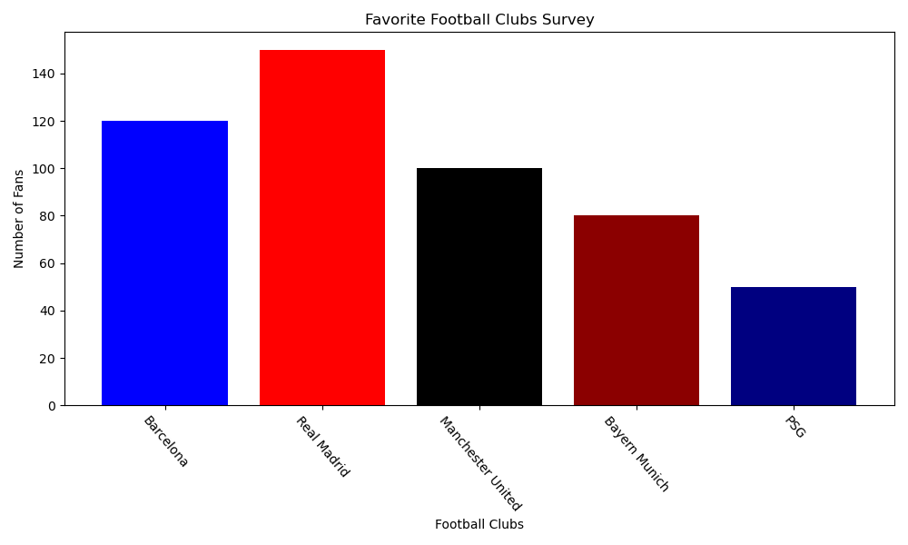

[bar chart code example (jupyter notebook)](../notebooks/02.%20Descriptive%20statistics.ipynb)

🔹 *Relative Frequency: Instead of raw counts, we can express data as a percentage:*
*Relative Frequency = $\frac{\text{Frequency}}{\text{Total Count}} \times 100$*

| Club               | Frequency | Relative Frequency (%) |
|--------------------|-----------|------------------------|
| Barcelona          | 120       | 24%                    |
| Real Madrid        | 150       | 30%                    |
| Manchester United  | 100       | 20%                    |
| Bayern Munich      | 80        | 16%                    |
| PSG                | 50        | 10%                    |

*Here is a pie chart representation of the relative frequency:*
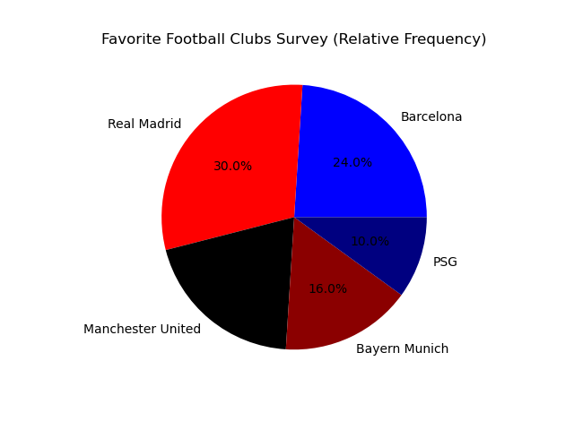
[pie chart code example (jupyter notebook)](../notebooks/02.%20Descriptive%20statistics.ipynb)

🔹 *Cumulative Frequency:*
*Cumulative frequency shows the running total of frequencies.*

| Club               | Frequency | Cumulative Frequency |
|--------------------|-----------|----------------------|
| Barcelona          | 120       | 120                  |
| Real Madrid        | 150       | 270                  |
| Manchester United  | 100       | 370                  |
| Bayern Munich      | 80        | 450                  |
| PSG                | 50        | 500                  |

*Here is a line chart representation of the cumulative frequency:*
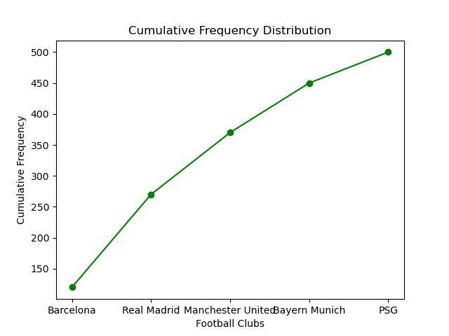
[Line chart code example (jupyter notebook)](../notebooks/02.%20Descriptive%20statistics.ipynb)

**b) Numerical Data Visualization**

📌 *Introduction*

*Numerical data consists of values that are measurable and continuous rather than categorical. Instead of distinct groups, numerical data can take on a wide range of values, making visualization crucial to understand patterns, distributions, and trends.*

📌 *Example: In the Titanic dataset (available in seaborn), the "Age" column represents numerical data. Since age values aren’t categorical, we must group them into bins (intervals) to analyze their distribution.*

📌 *Histogram*

*A Histogram is a visualization used for numerical data where we create bins (or buckets) to group similar values.*
🔹 *It’s similar to a bar chart, but instead of distinct categories, the bars represent continuous intervals of data.*
🔹 *In a histogram, the bars are connected because the data is continuous.*

📌 *Why Do We Need Bins in a Histogram?*

*Instead of counting exact numbers (e.g., Age = 18, Age = 19, etc.), we group ages into ranges (e.g., 0-10, 11-20, etc.).*
*The bin size affects how detailed or summarized the histogram appears:*
    *Too many bins → Overly detailed, hard to interpret.*
    *Too few bins → Oversimplified, may miss important patterns.*

📌 *Example: Titanic Dataset (Age Distribution Histogram)*

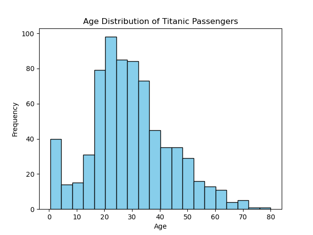

[code example (jupyter notebook)](../notebooks/02.%20Descriptive%20statistics.ipynb)

📌 *Types of Histograms*

1️⃣ *Symmetric Histogram (Bell-Shaped/Normal Distribution)*  
🔹 *Data is evenly distributed around the center.*  
🔹 *Example: Heights of people in a large population.*

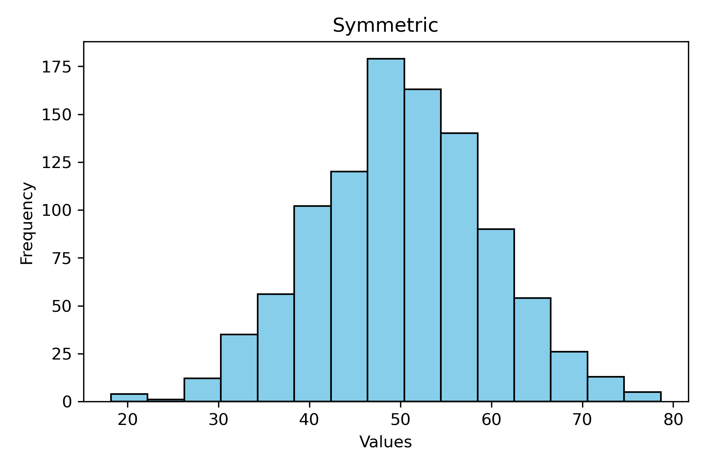

2️⃣ *Bimodal Histogram*  
🔹 *Has two peaks, indicating two dominant groups in the dataset.*  
🔹 *Example: Exam scores where two groups perform very differently (e.g., experts vs. beginners).*

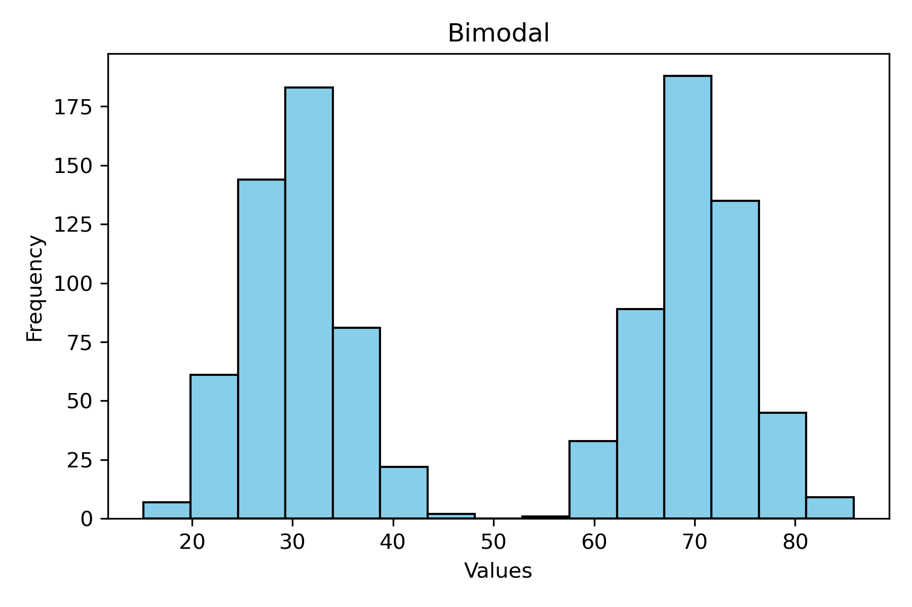

3️⃣ *Left-Skewed Histogram (Negatively Skewed)*  
🔹 *Long left tail (more values are concentrated on the right).*  
🔹 *Example: Age at retirement (most retire at 60+, few at younger ages).*

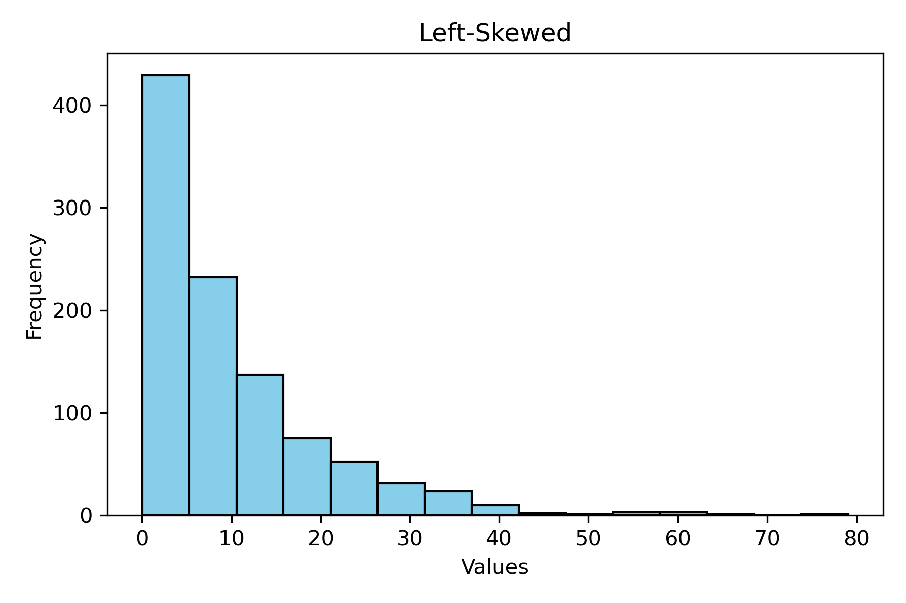

4️⃣ *Right-Skewed Histogram (Positively Skewed)*  
🔹 *Long right tail (more values are concentrated on the left).*  
🔹 *Example: Income distribution (few people earn extremely high salaries).*

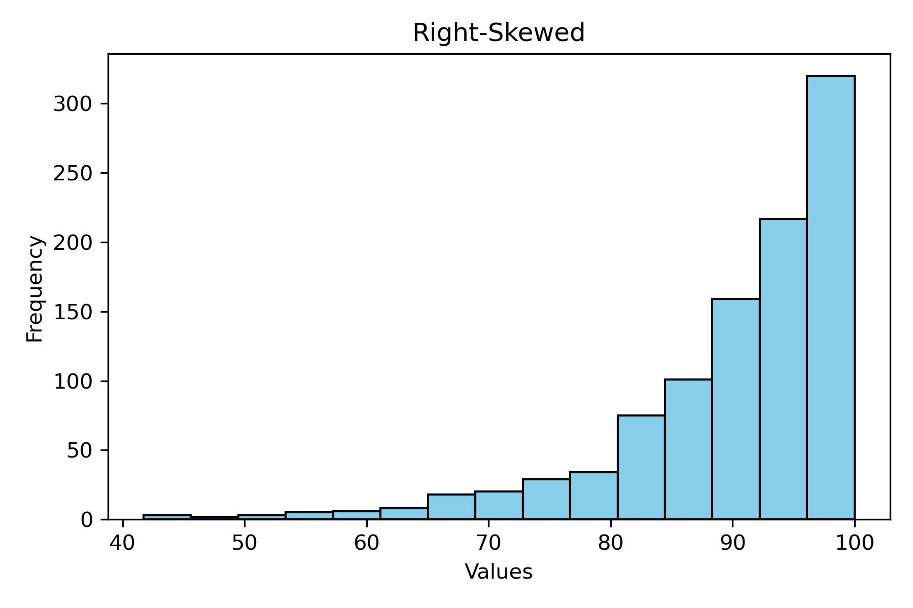

5️⃣ *Uniform Histogram*  
🔹 *All bins have roughly equal frequency (no clear pattern).*  
🔹 *Example: Rolling a fair die multiple times.*

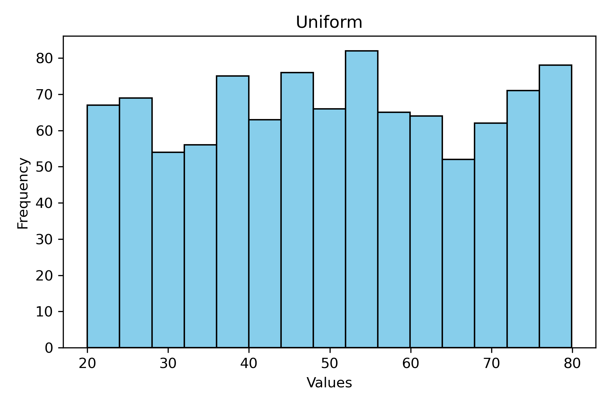

6️⃣ *No Clear Pattern*  
🔹 *Data doesn’t follow any specific shape, indicating randomness or mixed distributions.*

📌 **ii) Graphs for Bivariate Analysis**

*Bivariate analysis involves two variables and helps us understand their relationship. It can be categorized into three types based on the nature of the variables:*

1️⃣ *Categorical - Categorical* 🏷️📊  
2️⃣ *Numerical - Numerical* 🔢📉  
3️⃣ *Categorical - Numerical* 🏷️🔢  

📌 *a) Categorical - Categorical Variables*

*When both variables are categorical, we analyze how one category is related to another.*

📌 *Contingency Table (Cross Tabulation)*

🔹 *A contingency table (cross-tabulation table) is used to summarize the frequency distribution of two categorical variables.*  
🔹 *It helps us count occurrences and see how categories interact.*  

📌 *Example: Titanic Dataset*

*Consider the Titanic dataset, where we analyze:*

📌 *Survival status ("survived") vs. Passenger class ("class")*

🚢 *Question: Does survival depend on passenger class?*

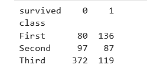

📌 *Jupyter Notebook Code: [Creating a Contingency Table](../notebooks/02.%20Descriptive%20statistics.ipynb)*

📌 *Interpreting the table:*

- *Rows represent passenger class (First, Second, Third).*  
- *Columns represent survival status (0 = Not survived, 1 = Survived).*  
- *Each cell shows the count of passengers in that class who survived or not.*

*Now that we have a contingency table, we can plot a grouped bar chart to visualize the relationship between the two categorical variables.*

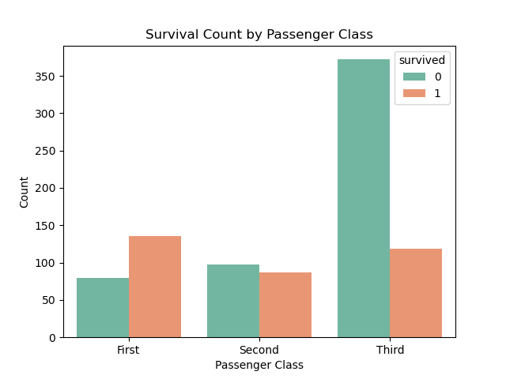

*📌 Jupyter Notebook Code: [Grouped Bar Chart using Seaborn](../notebooks/02.%20Descriptive%20statistics.ipynb)*

📌 *b) Numerical - Numerical Variables*

*When both variables are numerical, we analyze how they relate to each other. This helps in identifying patterns, trends, and correlations between two continuous variables.*

📌 *Common Plots for Numerical-Numerical Analysis*

📌 *1️⃣ Scatter Plot – Used to visualize the relationship between two numerical variables.*  
📌 *2️⃣ Line Plot – Used when one variable (like time) is continuous.*  
📌 *3️⃣ Heatmap (Correlation Matrix) – Shows correlation values between multiple numerical features.*  

📌 *Scatter Plot*

🔹 *Best for identifying relationships, trends, and outliers.*  
🔹 *Helps check linear, non-linear, or no correlation between variables.*

*Example: Titanic Dataset*

*Let’s analyze the relationship between age and fare (how age affects ticket price).*

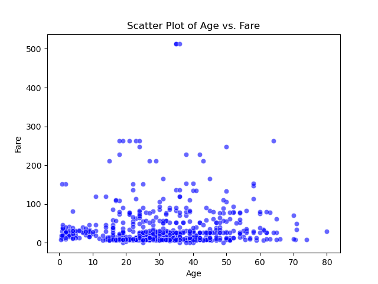

📌 *Insights from Scatter Plot*

✅ *Identifies patterns (e.g., do older people pay more?).*  
✅ *Reveals outliers (e.g., extremely high fares).*  
✅ *Helps decide if further statistical analysis is needed.*  

📌 *Jupyter Notebook Code: [Scatter Plot](../notebooks/02.%20Descriptive%20statistics.ipynb).*

📌 *c) Categorical - Numerical Analysis*

*When analyzing a categorical variable (e.g., "Gender", "Class") with a numerical variable (e.g., "Age", "Fare"), we look at how the numerical data is distributed across different categories. Unlike categorical-categorical relationships (which are based on counts), here, we perform aggregations on the numerical column (e.g., Mean, Median, Sum, etc.).*

📌 *Key Visualization Techniques*

✅ *Bar Chart with Aggregation → Average, Sum, or Median of a numerical variable grouped by a categorical column.*  
✅ *Box Plot → Shows the distribution (min, max, quartiles, median, and outliers) of a numerical variable for each category.*  
✅ *Violin Plot → A more detailed version of the box plot, showing the density distribution.*  
✅ *Crosstab with Binning → Converts numerical values into bins and summarizes them across categories.*  

1️⃣ *Bar Chart (Aggregation on Numerical Column)*

🔹 *When the y-axis represents a numerical column, it must be aggregated (e.g., mean fare for each passenger class).*  

📌 *Example: Average Fare Paid by Passenger Class*

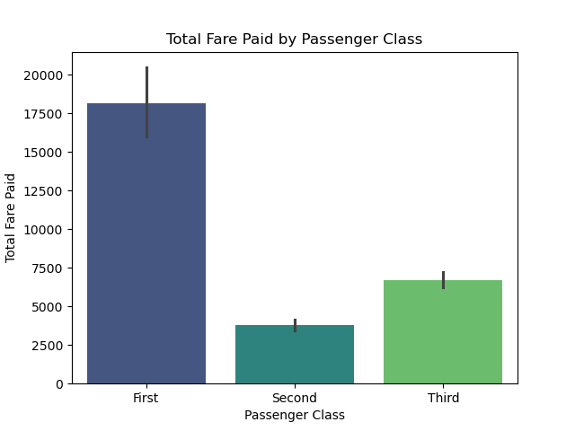

🔹 *The bar height represents the total fare paid by each class.*  
🔹 *We can change estimator=sum to estimator=mean for average fare per class.*  

📌 *Jupyter Notebook Code: [example code](../notebooks/02.%20Descriptive%20statistics.ipynb).*

2️⃣ *Crosstab with Binning (Numeric Breakdown into Buckets)*

🔹 *If a numerical variable is continuous (e.g., "Age"), we can convert it into bins (age groups) and analyze how it varies across categories.*

📌 *Example: Age Groups vs. Sex (How many passengers fall in each age group per gender?)*

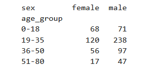

🔹 *Breaks "Age" into bins (e.g., 0-18, 19-35, etc.).*  
🔹 *Shows how many males and females fall into each age category.*  

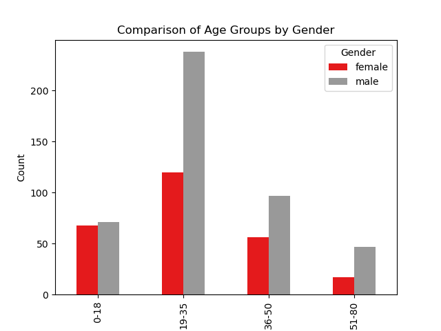

📌 *Jupyter Notebook Code: [example code](../notebooks/02.%20Descriptive%20statistics.ipynb).*

