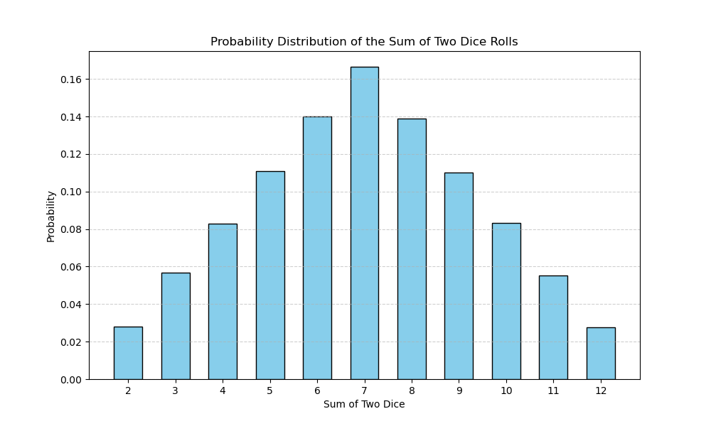
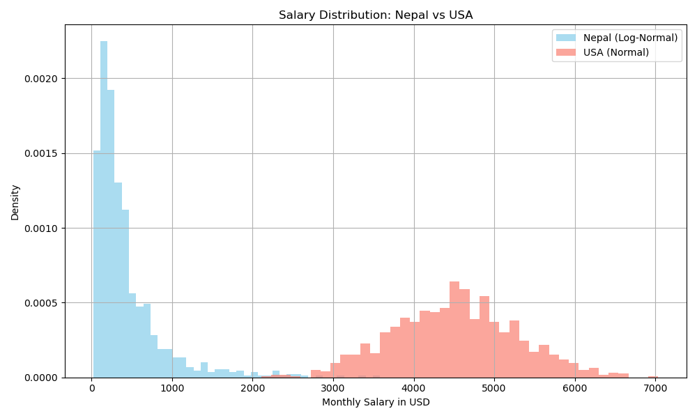
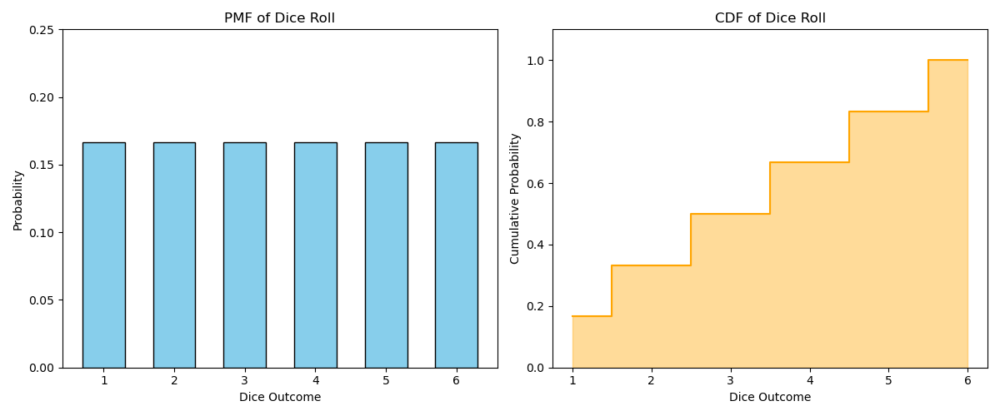
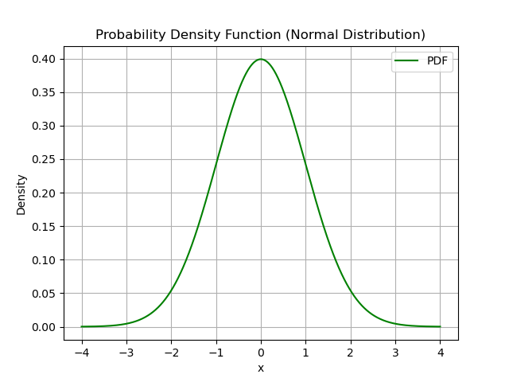
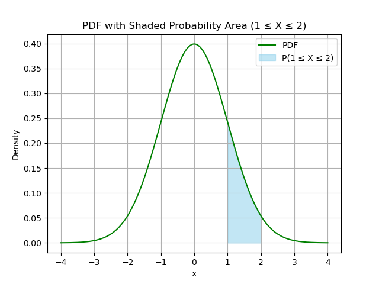
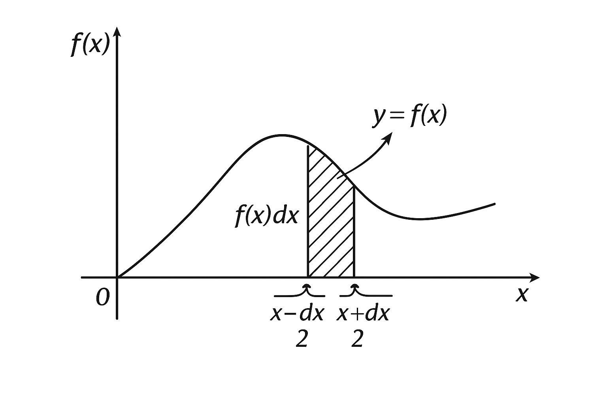
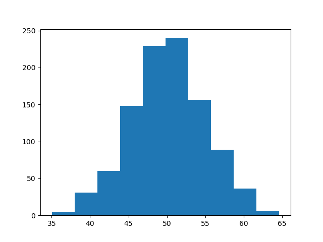
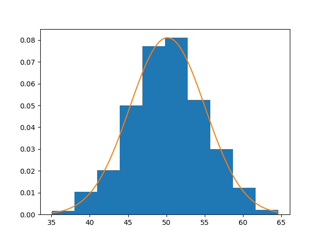
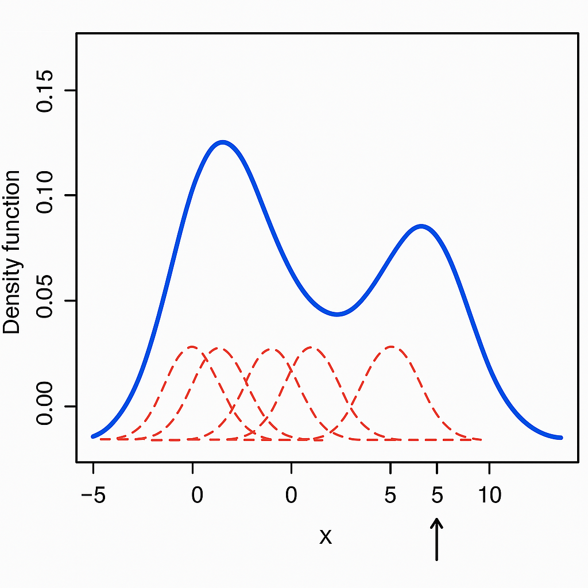
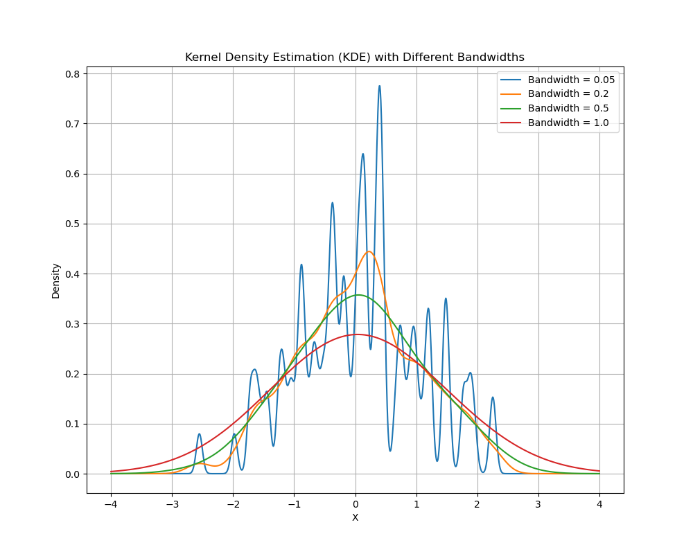

# Probability Distributions

## Random Variable
A random variable is a numerical value determined by the outcome of a random phenomenon or experiment. It's a way to quantify randomness. In other words, it represents possible outcomes of an experiment and assigns numerical values to these outcomes.

**Example:**
Imagine you roll a six-sided dice. The outcome of the roll (which can be 1, 2, 3, 4, 5, or 6) is a random variable because the result is determined by chance.

If we call this random variable \( X \), then:
- \( X \) can take the value 1 if you roll a 1.
- \( X \) can take the value 2 if you roll a 2.
- And so on, until \( X \) can take the value 6 if you roll a 6.

### Algebraic Variable
An algebraic variable, on the other hand, is a symbol used to represent a number in mathematical expressions and equations. The value of an algebraic variable is typically unknown until you solve the equation or expression.

**Example:**
Consider the equation \( y = 3x + 2 \). Here, \( x \) and \( y \) are algebraic variables:
- \( x \) can represent any real number.
- Once you know the value of \( x \), you can calculate the value of \( y \).

### Key Differences
1. **Deterministic vs. Random:** 
   - **Random Variable:** The value is determined by a random process.
   - **Algebraic Variable:** The value is typically unknown but is determined by solving an equation or expression.

2. **Context of Use:**
   - **Random Variable:** Often used in probability and statistics.
   - **Algebraic Variable:** Used in algebra, calculus, and other areas of mathematics.

## What is Probability Distributions ?

A **Probability Distribution** is a list of all possible outcomes of a random variable, along with their corresponding probability values.

For example, if we consider a coin toss, this experiment is random, and we can define a random variable, say *X*, as:  
*X = {1 (H), 0 (T)}*  
where 1 represents heads and 0 represents tails. Now, if we assign corresponding probability values to the possible outcomes of the random variable (H and T in this case), it is called a probability distribution.

| Coin Toss      | 1 (H) | 0 (T) |
|----------------|-------|-------|
| Probabilities  | 1/2   | 1/2   |

### 🎲 Flipping Two Dice Example

Let’s consider the example of flipping two dice at the same time. We want to sum their outcomes and assign a corresponding probability function. The random variable becomes:

- For **Dice 1**, \( X_1 = \{1, 2, 3, 4, 5, 6\} \)
- For **Dice 2**, \( X_2 = \{1, 2, 3, 4, 5, 6\} \)

---

### 🧮 Sum of Outcomes Table

| **Dice Roll (Dice 1)** | **1** | **2** | **3** | **4** | **5** | **6** |
|------------------------|-------|-------|-------|-------|-------|-------|
| **Dice 2 →**           |       |       |       |       |       |       |
| **1**                  | 2     | 3     | 4     | 5     | 6     | 7     |
| **2**                  | 3     | 4     | 5     | 6     | 7     | 8     |
| **3**                  | 4     | 5     | 6     | 7     | 8     | 9     |
| **4**                  | 5     | 6     | 7     | 8     | 9     | 10    |
| **5**                  | 6     | 7     | 8     | 9     | 10    | 11    |
| **6**                  | 7     | 8     | 9     | 10    | 11    | 12    |

---

### 📊 Frequency and Probability Table

Total number of outcomes = \( 6 x 6 = 36 \)

| **Sum (Outcomes)** | **Combinations**                               | **Frequency** | **Probability** |
|--------------------|------------------------------------------------|---------------|------------------|
| 2                  | (1,1)                                          | 1             | 1/36             |
| 3                  | (1,2), (2,1)                                    | 2             | 2/36             |
| 4                  | (1,3), (2,2), (3,1)                             | 3             | 3/36             |
| 5                  | (1,4), (2,3), (3,2), (4,1)                      | 4             | 4/36             |
| 6                  | (1,5), (2,4), (3,3), (4,2), (5,1)               | 5             | 5/36             |
| 7                  | (1,6), (2,5), (3,4), (4,3), (5,2), (6,1)        | 6             | 6/36             |
| 8                  | (2,6), (3,5), (4,4), (5,3), (6,2)               | 5             | 5/36             |
| 9                  | (3,6), (4,5), (5,4), (6,3)                      | 4             | 4/36             |
| 10                 | (4,6), (5,5), (6,4)                             | 3             | 3/36             |
| 11                 | (5,6), (6,5)                                    | 2             | 2/36             |
| 12                 | (6,6)                                          | 1             | 1/36             |

---

### 📐 Probability Function \( P(X = x) \)

$$
P(X = x) =
\begin{cases}
\frac{1}{36} & \text{if } x = 2 \text{ or } x = 12 \\
\frac{2}{36} & \text{if } x = 3 \text{ or } x = 11 \\
\frac{3}{36} & \text{if } x = 4 \text{ or } x = 10 \\
\frac{4}{36} & \text{if } x = 5 \text{ or } x = 9 \\
\frac{5}{36} & \text{if } x = 6 \text{ or } x = 8 \\
\frac{6}{36} & \text{if } x = 7 \\
0 & \text{otherwise}
\end{cases}
$$
  

[Code Example (Jupyter Notebook)](../notebooks/03.%20Probability%20Distribution%20Functions.ipynb)  


### What if we have 100 dice for the experiment?

If we were to toss **100 dice** in the experiment, creating a table to represent all possible outcomes would be impractical due to the sheer number of combinations. In real-world scenarios, the number of outcomes can be significantly larger, making the creation of such tables tedious and inefficient.

---

### **Solution**

Instead of writing a distribution table, we could use a **mathematical function** to model the relationship between outcomes and their corresponding probabilities. This approach simplifies the representation and provides additional benefits.

#### **Benefits of a Mathematical Model**
- Produces outputs/probabilities for all values without requiring a physical table.
- Can be visualized using graphs, showing the shape of the probability distribution.

Such functions are known as **Probability Distribution Functions**, commonly referred to as **Probability Distributions**.

---

This solution allows us to handle complex scenarios more effectively while gaining deeper insights through graphical and mathematical representations.

### Types of Probability Distribution Functions (PDF)

Probability Distribution Functions (PDFs) can be broadly divided into two major types:

---

### 1. **Discrete Probability Distribution**
A discrete probability distribution applies to scenarios where the random variable can take on a countable number of distinct values. The probability of each outcome is explicitly defined, and the total sum of probabilities equals 1.

#### Examples:
- **Bernoulli Distribution**: Represents a single trial with two possible outcomes, such as success (1) and failure (0).
- **Binomial Distribution**: Models the number of successes in a fixed number of independent trials, such as flipping a coin multiple times.
- **Poisson Distribution**: Describes the probability of a number of events occurring in a fixed interval of time or space, such as the number of calls a call center receives in an hour.

---

### 2. **Continuous Probability Distribution**
A continuous probability distribution is used when the random variable can take on an infinite number of possible values within a range. These are represented by probability density functions, and the probability of a specific value is zero (but ranges have probabilities).

#### Examples:
- **Normal Distribution (Gaussian)**: A symmetric, bell-shaped curve that models many natural phenomena like heights, weights, or test scores.
- **Exponential Distribution**: Models the time between events in a Poisson process, such as the lifespan of a device.
- **Uniform Distribution**: All values within a given range are equally likely, such as random numbers between 0 and 1.

---

### Importance of Probability Distributions

- **Provides Insights into Data Shape:** Probability distributions give us an understanding of the shape or distribution of the data, which helps in identifying patterns, trends, and central tendencies.
  
- **Leverages Famous Distributions:** If our data follows a well-known probability distribution, we gain significant insights about the data automatically. For instance:
  - We can predict certain outcomes.
  - We can apply known statistical methods and properties directly.

Probability distributions are fundamental tools for analyzing and interpreting data effectively in numerous fields, from science to business decision-making.

### 🇳🇵 vs 🇺🇸 Salary Distribution: Real-World Example of Probability Distributions

### 🎯 Goal: Understand how probability distributions help analyze data

Let’s compare monthly salary distributions in Nepal and the United States to understand how different data patterns emerge and how distributions help us.

---

### 🔍 Hypothetical Data Assumption

| **Country** | **Avg Monthly Salary (USD)** | **Distribution Type**     | **Description**                                                                 |
|-------------|------------------------------|---------------------------|---------------------------------------------------------------------------------|
| Nepal       | $300                         | Right-skewed (Log-Normal) | Most people earn below the average; a few earn much higher.                    |
| USA         | $4,500                       | Normal (Bell Curve)       | Salaries are more symmetrically distributed around the mean.                   |


  

### ✅ Interpretation:

- **Nepal (Log-Normal):**  
  The distribution is skewed to the right. Most people earn between $100–$500, but a few earn more than $1000.

- **USA (Normal):**  
  The distribution is centered around $4500. Most people earn near the average, with fewer people earning extremely low or extremely high amounts.


[Code Example (Jupyter Notebook)](../notebooks/03.%20Probability%20Distribution%20Functions.ipynb)  

### A Note on Parameters

Parameters in probability distributions are numerical values that determine the **shape**, **location**, and **scale** of the distribution.

Different probability distributions have unique sets of parameters that define their shape and characteristics. Understanding these parameters is essential for **statistical analysis** and **inference**, as they provide deeper insights into the data and its behavior.


## Probability Distributions Functions
A probability Distribution Function (PDF) is a mathematical function that describes the probability of obtaining different values of a random variable in a particular probability distribution.

### Types of Probability Distribution Functions

Probability Distribution Functions can be divided into two main types:  
- **Probability Mass Function (PMF):**  
  The function that represents the probability distribution for discrete random variables.

- **Probability Density Function (PDF):**  
  The function that represents the probability distribution for continuous random variables.

---

#### **Cumulative Distribution Function (CDF):**  
The CDF is a probability distribution function that can be derived from the above two distribution functions, PMF and PDF.

### 🎯 Probability Mass Function (PMF)

Let `X` be a **discrete random variable** taking values `x₁, x₂, x₃, ..., xₙ`, with corresponding probabilities:  
`pᵢ = P(X = xᵢ)`, where `i = 1, 2, 3, ..., n`

A **Probability Mass Function (PMF)** assigns a probability to each value of a discrete random variable and must satisfy the following two conditions:

---

### ✅ PMF Conditions:

1. **Non-Negativity:**  
   `P(X = xᵢ) ≥ 0` for all `i`  
   Every probability must be zero or positive.

2. **Total Probability is One:**  
   `Σ pᵢ = 1`  
   The sum of all individual probabilities must equal 1.

---

### 📘 Explanation:

- `P(X = xᵢ)` represents the probability that the random variable `X` takes the value `xᵢ`.
- Each `xᵢ` is a possible outcome, and `pᵢ` is the probability of that specific outcome.

---

### 🎲 Example: Rolling a Fair Die

Let the random variable `X` represent the outcome of rolling a fair 6-sided die.

- Possible values:  
  `X = {1, 2, 3, 4, 5, 6}`

- Probabilities:  
  `P(X = xᵢ) = 1/6`, for all `i = 1 to 6`

**Checking PMF Conditions:**

- All probabilities `= 1/6 ≥ 0` ✅  
- Sum: `1/6 + 1/6 + 1/6 + 1/6 + 1/6 + 1/6 = 1` ✅

---

### ✅ Conclusion:

This is a **valid PMF**, as both required conditions are satisfied.

#### 📈 Cumulative Distribution Function (CDF) of a PMF

The **Cumulative Distribution Function (CDF)**, denoted as `F(x)`, gives the probability that a discrete random variable `X` is **less than or equal to** a specific value `x`.

> **Definition:**  
> `F(x) = P(X ≤ x)`

It accumulates the probabilities from the **Probability Mass Function (PMF)** up to and including `x`.

---

### 🎲 Example: Rolling a Fair Die

Let `X = {1, 2, 3, 4, 5, 6}` represent the outcomes of a fair 6-sided die.  
Each outcome has a probability:  
`P(X = x) = 1/6` for all `x ∈ X`

To compute the **CDF**, we add the probabilities of all outcomes up to a specific value.

#### 📌 Example Calculation:
- `F(4) = P(X ≤ 4) = P(1) + P(2) + P(3) + P(4)`
- `F(4) = 1/6 + 1/6 + 1/6 + 1/6 = 4/6 ≈ 0.667`

---

### 🧠 Key Differences Between PMF and CDF

| Value of `x` | PMF → `P(X = x)`     | CDF → `P(X ≤ x)`                    |
|--------------|----------------------|--------------------------------------|
| x = 4        | `P(X = 4) = 1/6`     | `P(X ≤ 4) = 4/6` (sum of 1 to 4)     |

- **PMF** gives the probability **at a specific value**.
- **CDF** gives the **cumulative probability up to and including** that value.

---

### 📊 Graph Insight

- **PMF graph:** Points at each `x`, showing individual probabilities.
- **CDF graph:** A step function increasing as `x` increases, showing accumulation of probabilities.



[python code example](../notebooks/03.%20Probability%20Distribution%20Functions.ipynb)


### 📊 Probability Density Function (PDF)



When dealing with **continuous random variables** like height, time, weight, etc., we **cannot find the probability of a single exact value**, like \( P(X = 2) \).

> **But why?**

Imagine the graph above (a bell curve, known as the **normal distribution**, which we’ll discuss later in detail). The x-axis ranges from -4 to 4. If we try to find the probability at an **exact point** like \( x = 2 \) or \( x = 2.11 \), we face a problem:

🔹 Between -4 and 4, there are **infinitely many real numbers**.  
🔹 The **probability of picking exactly one number from an infinite set is almost zero**.  

Hence, **in continuous distributions, the probability at a single point is 0**:
```
P(X = any exact value) = 0
```

So, what do we do instead?

---

### ❓ What is *Probability Density*?

We don't find the probability of an **exact value**.  
Instead, we find the probability of a value **lying between two close numbers** — say between 1 and 2.

To do this, we use the **Probability Density Function (PDF)**, denoted as \( f(x) \).

👉 The probability that the value lies **between a and b** is found by calculating the **area under the curve** of \( f(x) \) from \( a \) to \( b \):

---

### 📐 Area as Probability



This shaded region represents the probability that a value lies between 1 and 2:

$$
P(1 \leq X \leq 2) = \int_{1}^{2} f(x)\,dx
$$
---

### 🔍 General PDF Representation



Let’s say:

- \( X \) is a **continuous random variable**
- \( f(x) \) is the **Probability Density Function (PDF)**

Then:

---

### 📌 Properties of PDF

✅ **1. Small Interval Probability Approximation**

The probability that \( X \) lies **very close** to some value \( x \) (within a small interval \( dx \)):

$$
P\left(x - \frac{dx}{2} \leq X \leq x + \frac{dx}{2}\right) \approx f(x)\cdot dx
$$

This means:  
 The **height** of the curve at \( x \) times a **tiny width** \( dx \) gives us the **approximate probability** near \( x \).

---

✅ **2. Total Area = 1**

Since the total probability of all possible outcomes must be 1:

$$
\int_{-\infty}^{\infty} f(x)\,dx = 1
$$

In most cases, \( f(x) \) is non-zero only in a certain range (e.g., \( 0 < x < 1 \)), so we only integrate over that range.

---

✅ **3. \( f(x) \geq 0 \) for all \( x \)**

Since probabilities can’t be negative, the PDF must always be **non-negative**.

---

✅ **4. Probability Between Two Values**

To find the probability that \( X \) lies between \( a \) and \( b \):

$$
P(a \leq X \leq b) = \int_{a}^{b} f(x)\,dx
$$

#### Probability Density Estimation

If we have continuous data and we want to calculate the probability density function (PDF), we first need to estimate the density (i.e., the y-axis of the PDF). Unlike simple probability calculation, this is not straightforward — so we use a technique called **density estimation**.

**Density estimation** is a statistical technique used to estimate the probability density function (PDF) of a random variable based on a set of observations or data.  
In simple terms, it involves estimating the **underlying distribution** of a set of data points.

It is widely used in:
- Hypothesis testing  
- Data analysis  
- Data visualization  
- Machine learning  

---

### Methods of Density Estimation

There are two major approaches to density estimation:

1. **Parametric Density Estimation**  
2. **Non-parametric Density Estimation**

---

#### 1. Parametric Density Estimation

**Parametric density estimation** involves assuming that the data follows a known distribution with a fixed set of parameters, such as the **Normal**, **Exponential**, or **Poisson** distributions.

#### Why is it called Parametric?

Because the graph (PDF) is defined by specific **parameters** such as:
- Mean (μ)
- Standard deviation (σ)

---

### Working of Parametric Density Estimation

1. **Plot the histogram** of the given data (or use other visualization methods).
2. **Identify the distribution** the data appears to follow (e.g., Normal distribution).
3. **Calculate the parameters** (like mean and standard deviation) from the data.
4. **Fit the assumed distribution** with these parameters over the histogram.

---

#### Example:

Below is a histogram of some observed data:



From the histogram, we can **visually assume** that the distribution is **normal**.  
Next, we compute the **sample mean** and **sample standard deviation**, and fit a normal distribution on this data.

---

After fitting the distribution:



You can see how the curve now estimates the density over the histogram.

---

### Code Example

Here is the full code and step-by-step implementation using Python:

📁 [Python Code Example – PDF Estimation Notebook](../notebooks/03.%20Probability%20Distribution%20Functions.ipynb)

#### Non-Parametric Density Estimation (KDE)

Sometimes the data doesn't clearly follow any known or famous probability distributions (like Normal, Poisson, etc.). In such cases, we use **Non-Parametric Density Estimation**.

---

### What is Non-Parametric Density Estimation?

**Non-parametric density estimation** is a statistical technique used to estimate the **probability density function (PDF)** of a random variable **without assuming any specific distribution**.

Unlike parametric methods (e.g., assuming a Normal distribution), non-parametric methods are **distribution-free** and **data-driven**.

---

### Why Use Non-Parametric Methods?

✅ No need to assume a predefined distribution  
✅ More flexible and adaptable to the shape of real data  
✅ Better suited for complex, irregular, or unknown distributions  

❗ However:
- It may require more data for accurate results  
- It can be computationally intensive

---

### Kernel Density Estimation (KDE)

One of the most common and powerful non-parametric methods is **Kernel Density Estimation (KDE)**.

---

### How KDE Works

KDE uses a **kernel function** to **smooth** each data point and create a continuous density curve.

> Think of the **kernel** as a small, smooth bump (usually a Normal/Gaussian curve) centered at each data point.

#### Step-by-step:

1. For **every data point**, place a **kernel (typically a Gaussian distribution)** centered at that point.
2. Each kernel contributes a small "bump" to the overall density.
3. Sum up the contributions from all kernels to get a **smooth curve** that represents the estimated PDF.

This method avoids the "binning" problems seen in histograms and provides a **much smoother and more accurate** visualization of the data distribution.

---

#### Visualization of KDE:

Imagine we have 5 data points. KDE places 5 smooth Gaussian bumps, one at each point. The resulting density curve is the **sum** of these bumps.

---

You can see a KDE plot in action in the following notebook:

📁 [Kernel Density Estimation - Python Example](../notebooks/03.%20Probability%20Distribution%20Functions.ipynb)

#### Kernel Density Estimation (KDE) and Bandwidth

In **Kernel Density Estimation (KDE)**, each data point is represented by a **kernel** (usually a **normal distribution**), and the **standard deviation** (σ) of the kernel determines how spread out each kernel is. This standard deviation is referred to as the **bandwidth** in KDE, and it plays a crucial role in shaping the final KDE curve.

1. **Standard Deviation (σ)**:
   - The **standard deviation** controls the **spread** of each kernel.
   - A **larger standard deviation (σ)** means that each kernel is **wider**, resulting in a **smoother** curve.
   - A **smaller standard deviation (σ)** means that each kernel is **narrower**, resulting in a **more jagged** or **bumpy** curve.

2. **Bandwidth**:
   - The **bandwidth** is essentially the width of the kernel and is equal to the **standard deviation** (σ) of the kernel distribution.
   - The choice of bandwidth is critical because:
     - **Small Bandwidth**: Leads to an **overfitted** curve, too sensitive to noise and fluctuations in the data.
     - **Large Bandwidth**: Leads to an **underfitted** curve, where the details are lost, and the curve becomes overly smooth.
   
### Intuition Behind Bandwidth:
- **Smaller Bandwidth**: The individual kernels (e.g., Gaussian curves) are narrow, which causes the KDE to have sharp peaks. The result is a curve that is very sensitive to the exact location of the data points but may pick up too much noise.
  
- **Larger Bandwidth**: The individual kernels are wider, causing the KDE curve to become smoother. The larger bandwidth captures more of the overall trend of the data, but may miss out on finer details or peaks within the data.

### Visualizing Bandwidth:
- A **smaller bandwidth** will produce a **more jagged** and **less smooth** curve, highlighting the noise and small fluctuations in the data.
- A **larger bandwidth** will produce a **smoother** and **more generalized** curve, potentially missing finer data details but better capturing the overall trend.
  
The choice of **bandwidth** is a **hyperparameter** in KDE and can significantly affect how well the density estimate fits the data.



📁 [Bandwidth visualization - Python Example](../notebooks/03.%20Probability%20Distribution%20Functions.ipynb)

#### Cumulative Distribution Function (CDF) of PDF

The **Cumulative Distribution Function (CDF)** is a concept closely related to the **Probability Density Function (PDF)**. It provides a way to understand the probability that a random variable **X** takes a value less than or equal to a given point.

While the **PDF** describes the likelihood of a random variable falling within a specific range, the **CDF** describes the cumulative probability up to a certain value.

---

### Relationship Between PDF and CDF:
1. The **CDF** is the integral (area under the curve) of the **PDF** from negative infinity to a given point `x`.
   
   Mathematically:
   $$
   F(x) = P(X \leq x) = \int_{-\infty}^{x} f(t) \, dt
   $$

   Here:  
- \( f(t) \) is the **PDF** of the random variable **X**.  
- \( F(x) \) is the **CDF**, which represents the probability that \( X \) is less than or equal to \( x \).

2. **CDF** gives the **accumulated probability** up to the point **x**. It ranges from 0 to 1 as **x** moves from negative infinity to positive infinity.
   - \( F(-\infty) = 0 \): There is no probability for values less than any possible value.  
   - \( F(\infty) = 1 \): The total probability of all outcomes is 1.

---

### Visualizing the CDF:
- The **CDF curve** starts at 0 and increases as you move to the right along the x-axis.
- The CDF is **non-decreasing** and **smooth**. It either increases gradually or in steps, depending on the distribution.
- The CDF for continuous distributions is smooth and continuous, while for discrete distributions, it might increase in steps.

---

### Key Points:
- The **PDF** represents the density of probability at a particular point, while the **CDF** represents the cumulative probability up to that point.
- The **CDF** gives us a **probability** of a random variable being less than or equal to a specific value.
- The **PDF** can be derived from the **CDF** by differentiation,i.e., 
$$
f(x) = \frac{d}{dx} F(x)
$$

---

### Example: For a Normal Distribution:
- If **X** follows a normal distribution, the **PDF** gives the probability density for each value of **X**.
- The **CDF** for a normal distribution provides the cumulative probability of **X** being less than or equal to any given value.

---

Thus, the **CDF** is an integral (cumulative sum) of the **PDF**, and together, they provide a comprehensive understanding of the distribution of random variables.